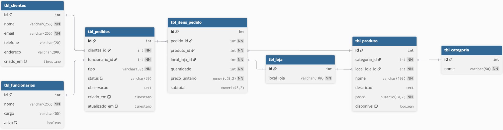

# 🍔 Lanchonete da Fé – Sistema de Pedidos

## 📌 Sobre o Projeto

Este projeto foi desenvolvido como parte de um **desafio técnico backend**, com o objetivo de modelar e implementar um sistema de pedidos para uma lanchonete.

A aplicação simula o funcionamento de um ambiente real, incluindo cadastro de produtos, clientes, pedidos e controle de faturamento, utilizando **PostgreSQL** como banco de dados.

### Modelagem lógica

> Modelagem no dbdiagram: [https://dbdiagram.io/d/diner-fe-mod-logica-69cc93dc78c6c4bc7ab68d0f"](https://dbdiagram.io/d/diner-fe-mod-logica-69cc93dc78c6c4bc7ab68d0f)

## 🎯 Objetivo do Desafio

O principal objetivo foi:

- Modelar um banco de dados relacional eficiente
- Garantir integridade dos dados com uso de constraints
- Representar um fluxo real de pedidos
- Criar consultas úteis para o negócio

---

## 🧠 Regras de Negócio

O sistema contempla:

- Uma **loja física**
- Cadastro de:
  - Clientes
  - Funcionários
  - Produtos
  - Categorias
- Criação de pedidos com:
  - Tipo (local, retirada, delivery)
  - Status (pendente, em preparo, pronto, entregue, cancelado)
- Associação de múltiplos itens por pedido
- Cálculo automático de subtotal por item

---

## 🏗️ Modelagem do Banco

### Entidades principais:

- `tbl_loja`
- `tbl_clientes`
- `tbl_funcionarios`
- `tbl_categoria`
- `tbl_produto`
- `tbl_pedidos`
- `tbl_itens_pedido`

### Relacionamentos:

- Um cliente pode ter vários pedidos
- Um pedido possui vários itens
- Um produto pertence a uma categoria
- Um pedido é atendido por um funcionário
- Um item está vinculado a um produto e a um pedido

---

## ⚙️ Tecnologias Utilizadas

- PostgreSQL
- SQL (DDL + DML + Queries analíticas)
- pgAdmin (para gerenciamento)
- DBDiagram (para visualização do modelo)

---

## 🗃️ Estrutura do Banco

O banco foi estruturado com:

- **Chaves primárias** auto incrementais
- **Chaves estrangeiras** para integridade referencial
- **Constraints**:
  - `NOT NULL`
  - `UNIQUE`
  - `CHECK`
- **Campos calculados** (`subtotal`)
- **Timestamps automáticos**

---

## 📊 Consultas Implementadas

O projeto inclui queries voltadas para o negócio:

### 🔹 Listagem de pedidos com cliente
Exibe todos os pedidos com status e informações do cliente

### 🔹 Total por pedido
Soma os valores dos itens

### 🔹 Pedidos em aberto
Filtra pedidos pendentes ou em preparo

### 🔹 Produtos mais vendidos
Ranking por quantidade e receita

### 🔹 Faturamento por categoria
Agrupamento financeiro por tipo de produto

### 🔹 Histórico por cliente
Consulta pedidos de um cliente específico

### 🔹 Faturamento total
Soma geral excluindo pedidos cancelados

---

## 🧪 Dados de Teste

Foram inseridos dados fictícios para:

- Produtos (lanches, bebidas, sobremesas, etc.)
- Clientes
- Funcionários
- Pedidos com diferentes status

Isso permite simular cenários reais e testar consultas.

---

## 🚀 Como Executar

1. Criar um banco no PostgreSQL
2. Executar o script SQL completo (DDL + DML)
3. Rodar as queries para análise

---

## 📈 Possíveis Melhorias

- Implementar API (Node.js / Java / etc.)
- Criar autenticação de usuários
- Separar status em tabela própria (normalização)
- Implementar controle de estoque
- Adicionar múltiplas lojas
- Criar dashboard (BI)

---

## 👨‍💻 Autor

Desenvolvido por **Igor Bastos Alencar**

---

## 💼 Contexto Profissional

Este projeto foi desenvolvido com foco em:

- Demonstrar conhecimento em modelagem de banco de dados
- Aplicar boas práticas de SQL
- Simular cenários reais de negócio
- Servir como peça de portfólio para vagas backend